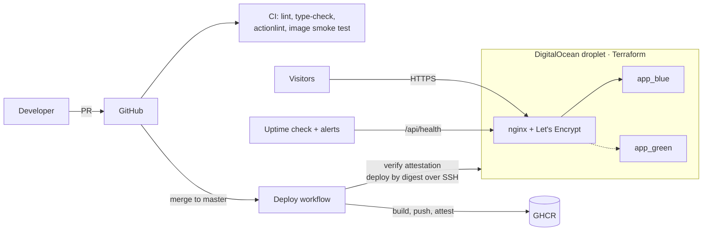

# Mochila — demo travel site

**Live demo:** https://travel.josanfersal.dev

Next.js website I originally built for a real travel agency and ran in production. After the client closed, I turned it into a fictional portfolio demo ("Mochila") and rebuilt its whole delivery pipeline: infrastructure as code, signed container images, zero-downtime blue/green deploys, one-click rollbacks and monitoring.

> **Demo only:** the agency is fictional, no bookings are made and the contact form sends nothing.

## Highlights

|                            |                                                                                                                                                                                                                                |
| -------------------------- | ------------------------------------------------------------------------------------------------------------------------------------------------------------------------------------------------------------------------------ |
| **Zero-downtime deploys**  | Blue/green behind nginx. Measured during a real deploy: **1,165 requests, 0 failures**, version switch in under a second                                                                                                       |
| **Rollback**               | Redeploys any of the last 5 images in **~20 seconds**, skipping the build (616 requests, 0 failures)                                                                                                                           |
| **Supply chain**           | Every image gets a **SLSA build provenance attestation** signed with Sigstore (GitHub OIDC, no stored keys). The pipeline verifies it and **deploys by digest**; an image without a valid attestation never reaches the server |
| **Infrastructure as code** | Server, firewall, SSH keys, uptime checks and alerts defined in Terraform                                                                                                                                                      |
| **Image size**             | 354 → **285 MB** (71 MB compressed) after removing the package manager and an unused native library variant                                                                                                                    |
| **Monitoring**             | External uptime check with alerts for downtime, latency and certificate expiry, plus CPU / memory / disk alerts — tested with real outages                                                                                     |

## Architecture



## Stack

- **App:** Next.js 15, React 19, TypeScript, Tailwind CSS, MUI, i18next
- **Container:** multi-stage Docker build, standalone Next.js on a minimal Alpine runtime (Node binary only, non-root user, healthcheck)
- **Infrastructure:** Terraform + DigitalOcean (1 vCPU / 1 GB droplet in Frankfurt), cloud firewall, cloud-init hardening
- **Web server:** nginx with Let's Encrypt (auto-renewed by certbot), HTTP/2, TLS 1.2/1.3 and security headers
- **CI/CD:** GitHub Actions, GitHub Container Registry, Dependabot
- **DNS:** Cloudflare (DNS only)

## Delivery pipeline

**On every pull request** (`ci.yml`, `validate-branches.yml`):

1. Branch naming and source rules (`feature/*` → `develop` → `master`, `hotfix/*` for urgent fixes)
2. ESLint and TypeScript type-check
3. **actionlint** (with shellcheck) on every workflow, so a broken pipeline is caught before it reaches `master`
4. Docker build **and a container smoke test**: the image is started and `/api/health` must answer

**On every merge to `master`** (`deploy.yml`):

1. Lint and type-check
2. Build and push the image to GHCR, tagged `sha-<commit>`, and generate a **build provenance attestation**
3. Resolve the image digest, **verify the attestation** against this repository and workflow, then deploy **by digest** (closing the gap between checking a tag and pulling it)
4. Copy `deploy/` to the server and run [`deploy.sh`](deploy/deploy.sh) over SSH with a restricted, deploy-only key
5. Smoke test the public URL
6. Keep the last 5 images in GHCR and prune the rest

### How a blue/green deploy works

[`deploy.sh`](deploy/deploy.sh) starts the new version on the idle colour, waits for the container healthcheck, points the nginx upstream at it, reloads nginx (no restart, no dropped connections) and stops the old colour. If the new version never becomes healthy, it is stopped and the current one keeps serving traffic. The previous image stays on the server, so rolling back to it does not even need the registry.

### Rollback

```bash
gh workflow run deploy.yml -f image_tag=sha-1a2b3c4
```

The rollback skips the build, verifies the image attestation and redeploys that exact image with the same blue/green process.

## Infrastructure

Everything in [`infra/terraform`](infra/terraform) is created with `terraform apply`:

- **Droplet** (Ubuntu 24.04) with the monitoring agent and IPv6
- **cloud-init:** Docker from the official repository, a non-root `deploy` user, key-only SSH with root login disabled, fail2ban, unattended security upgrades and 1 GB of swap
- **Firewall:** only ports 22, 80 and 443 are open
- **SSH keys:** a personal admin key and a separate CI key restricted to running commands (no port, agent or X11 forwarding, no TTY)
- **Monitoring:** uptime check on `/api/health` with alerts for downtime, latency (> 1.5 s) and certificate expiry (< 14 days), and resource alerts for CPU (80 %), memory (85 %) and disk (80 %)

Secrets never live in the repository: the DigitalOcean token and alert email come from environment variables, the Terraform state is git-ignored, and the deploy key is a GitHub Actions secret.

## Run locally

Requirements: Node.js 22.

```bash
npm ci
npm run dev
```

Open http://localhost:3000. No environment variables are needed: without an email provider configured, the contact form runs in demo mode and sends nothing.

Production build:

```bash
npm run build
npm start
```

Or with Docker:

```bash
docker build -t mochila --build-arg NEXT_PUBLIC_BASE_URL=http://localhost:3000 .
docker run --rm -p 3000:3000 mochila
```

## Repository layout

```
.github/            CI, deploy and branch-rule workflows, Dependabot
deploy/             Server side: docker-compose, nginx templates, deploy.sh
infra/terraform/    Droplet, firewall, SSH keys, cloud-init, monitoring
src/                Next.js app (pages router)
Dockerfile          Multi-stage build: deps → build → minimal runtime
```

## Lessons learned

- **Test the alert, not just the config.** The first uptime check used two regions to avoid false alarms; real outage tests showed that combination never fired the "down" alert. One region fixed it.
- **Docker layers only add.** Deleting files in a later layer does not shrink an image; they have to stay out of the final stage.
- **A tag is not an identity.** Verifying `sha-xxxx` and then pulling `sha-xxxx` leaves a gap; verifying and deploying the digest does not.
- **Linters catch form, not intent.** actionlint caught indentation and broken step references, but not a missing `env:` mapping — that needed review and an end-to-end test.

## Author

Jose Antonio Fernández Salado — [LinkedIn](https://www.linkedin.com/in/josanfersal/)

## License

[MIT](./LICENSE)
